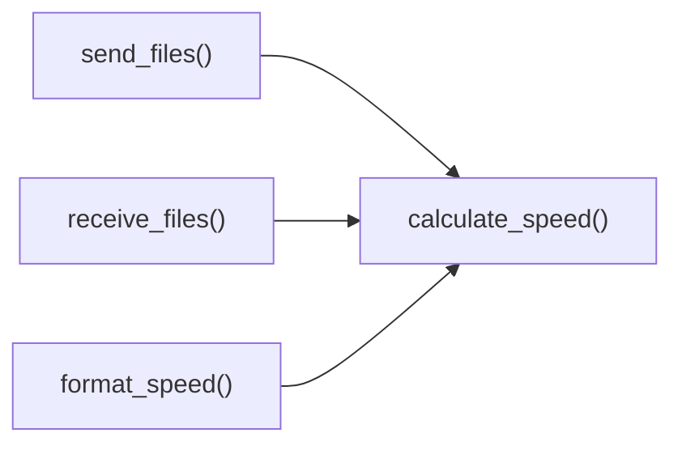

# calculate_speed()

Transfer speed calculation utility for real-time performance monitoring.

## Overview

Calculates transfer speed in bytes per second based on the number of bytes transferred and elapsed time. This utility function provides accurate speed measurements for file transfers, network operations, and performance monitoring, with built-in protection against division-by-zero errors.

## Call Graph

## Parameters

- **`bytes_transferred`** (int): Total number of bytes transferred
  - **Range**: 0 to very large values (limited by system memory)
  - **Units**: Bytes
- **`elapsed_time`** (float): Time elapsed during transfer in seconds
  - **Range**: > 0.0 for meaningful calculations
  - **Precision**: Supports microsecond precision

## Return Value

- **Type**: `float`
- **Units**: Bytes per second
- **Range**: 0.0 to theoretical maximum based on input values
- **Special Cases**: Returns 0.0 for zero elapsed time or negative values

## Requirements

calculate_speed() shall compute bytes per second when bytes_transferred and elapsed_time parameters are provided where computation uses simple division.

calculate_speed() shall return zero when elapsed_time is zero or negative where zero prevents division-by-zero errors.

calculate_speed() shall return zero when bytes_transferred is zero or negative where zero indicates no transfer occurred.

calculate_speed() shall return float value when computation succeeds where the value represents transfer rate in bytes per second.

calculate_speed() shall handle very large byte counts when high-volume transfers are measured where computation maintains numeric precision.
