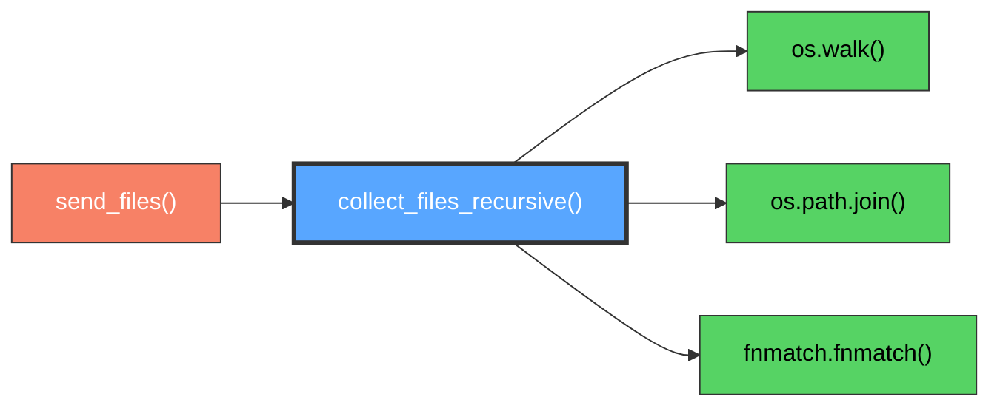

# collect_files_recursive()

Recursive file system traversal and collection for comprehensive directory processing.

## Overview

Recursively traverses directory structures to collect all files with optional filtering capabilities. This utility function provides comprehensive file discovery with pattern matching, symbolic link handling, and access permission validation for building complete file inventories and transfer manifests.

## Call Graph

## Parameters

- **`directory_path`** (str): Root directory path for recursive traversal
  - **Type**: String representing valid directory path
  - **Requirements**: Must exist and be accessible
- **`include_patterns`** (list, optional): Glob patterns for file inclusion
  - **Default**: None (include all files)
  - **Examples**: `['*.txt', '*.pdf']`, `['data_*.csv']`
- **`exclude_patterns`** (list, optional): Glob patterns for file exclusion
  - **Default**: None (no exclusions)
  - **Examples**: `['*.tmp', '__pycache__/*']`, `['.git/*']`

## Return Value

- **Type**: `list`
- **Content**: List of absolute file paths as strings
- **Ordering**: Typically sorted by path for consistent results
- **Empty**: Returns empty list if no files found or directory inaccessible

## Requirements

collect_files_recursive() shall traverse directory structure recursively when directory_path parameter is provided where traversal includes all subdirectories.

collect_files_recursive() shall collect all accessible files when traversing directories where files include regular files and exclude directories.

collect_files_recursive() shall apply include patterns when include_patterns parameter is provided where patterns use glob-style matching.

collect_files_recursive() shall apply exclude patterns when exclude_patterns parameter is provided where patterns filter out unwanted files.

collect_files_recursive() shall return list of absolute file paths when collection completes where paths are suitable for file operations.

## Security Considerations

### **Directory Traversal Security**
- **Path Validation**: Validates directory paths to prevent traversal attacks using "../" sequences
- **Absolute Path Resolution**: Converts all paths to absolute form to prevent relative path confusion
- **Symbolic Link Handling**: Safely processes symbolic links without following dangerous links outside intended scope
- **Access Control**: Respects file system permissions and only accesses authorized directories

### **File System Security**
- **Permission Checking**: Validates read permissions before attempting file operations
- **Safe Traversal**: Uses os.walk() which provides safe directory traversal with built-in protections
- **Error Handling**: Gracefully handles permission errors, broken links, and inaccessible files
- **Resource Limits**: Naturally limited by file system structure, preventing infinite recursion

### **Pattern Security**
- **Glob Pattern Validation**: Validates include/exclude patterns to prevent malicious pattern injection
- **Pattern Sanitization**: Uses fnmatch.fnmatch() which provides safe pattern matching
- **Case Sensitivity**: Handles case sensitivity consistently across different file systems
- **Special Character Handling**: Safely processes filenames with special characters and Unicode

### **Path Injection Prevention**
- **Input Sanitization**: Validates all input paths before processing
- **Path Canonicalization**: Resolves paths to canonical form to prevent ambiguous representations
- **Boundary Enforcement**: Ensures traversal stays within specified directory boundaries
- **Malicious Filename Handling**: Safely processes files with unusual names that might cause issues

### **Resource Protection**
- **Memory Management**: Efficiently handles large directory structures without excessive memory use
- **Traversal Limits**: Natural limits from file system structure prevent resource exhaustion
- **Handle Management**: Properly manages directory handles and file descriptors
- **Exception Safety**: Ensures resources are properly cleaned up on errors

### **Information Disclosure Prevention**
- **Access Control Respect**: Only returns information about accessible files
- **Error Message Safety**: Error messages don't reveal sensitive file system details
- **Directory Structure Protection**: Doesn't expose information about inaccessible directories
- **Metadata Security**: Only collects necessary path information, not sensitive metadata

### **Attack Surface Minimization**
- **Read-Only Operations**: Function only reads file system state, never modifies
- **Limited Scope**: Only operates on specified directories and their contents
- **No Network Operations**: Purely local file system operations with no external dependencies
- **Minimal System Calls**: Uses efficient system calls to minimize attack surface

### **File System Attack Mitigation**
- **Race Condition Resistance**: Uses atomic file system operations where possible
- **TOCTOU Protection**: Minimizes time between path validation and use
- **Symlink Attack Prevention**: Careful handling of symbolic links to prevent unauthorized access
- **Permission Bypass Prevention**: Validates permissions at each access point

### **Error Handling Security**
- **Fail-Safe Design**: Fails securely when encountering errors rather than exposing information
- **Exception Isolation**: Isolates exceptions to prevent information leakage
- **Consistent Error Response**: Provides consistent error handling across different failure modes
- **Recovery Safety**: Ensures partial results are properly cleaned up on failure
