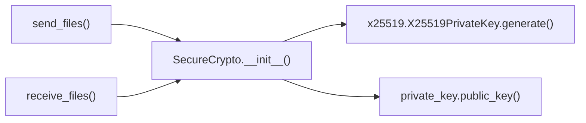

# SecureCrypto.__init__()

Initialize cryptographic key pair for secure session.

## Overview

The constructor initializes a fresh X25519 elliptic curve key pair for each SecureCrypto instance, establishing the foundation for secure key exchange and session encryption. This method generates ephemeral keys that provide perfect forward secrecy, ensuring that compromised keys cannot decrypt past communications.

## Call Graph

## Parameters

**None** - Standard constructor with no parameters required.

## Return Value

- **Type**: `SecureCrypto` instance
- **Description**: Initialized cryptographic context with fresh X25519 key pair

## Requirements

SecureCrypto.__init__() shall generate fresh X25519 private key when constructor is invoked where the key provides elliptic curve cryptographic capabilities.

SecureCrypto.__init__() shall derive public key from private key when private key generation completes where the public key enables key exchange operations.

SecureCrypto.__init__() shall initialize cipher attribute to None when key pair is established where the cipher will be set during session key derivation.

SecureCrypto.__init__() shall use cryptographically secure random number generation when generating private key where randomness ensures key unpredictability.

SecureCrypto.__init__() shall provide perfect forward secrecy when key pair is generated where ephemeral keys cannot decrypt past communications if compromised.
