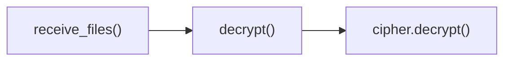

# SecureCrypto.decrypt()

ChaCha20Poly1305 authenticated decryption with integrity verification.

## Overview

Performs authenticated decryption using ChaCha20Poly1305 AEAD, automatically verifying data integrity and authenticity before returning plaintext. This method provides the inverse operation of `encrypt()`, ensuring that only authentic, unmodified ciphertext can be successfully decrypted.

## Call Graph

## Parameters

- **`ciphertext`** (bytes): Ciphertext with integrated authentication tag (minimum 16 bytes)
- **`nonce`** (bytes): 12-byte nonce that was used during encryption

## Return Value

- **Type**: `bytes`
- **Content**: Decrypted plaintext data
- **Size**: `len(encrypted_data) - 16` bytes (authentication tag removed)

## Requirements

decrypt() shall return plaintext data when provided with valid ciphertext and matching nonce where the ciphertext contains integrated authentication tag.

decrypt() shall verify authentication tag before returning plaintext when decryption is attempted where verification ensures data integrity and authenticity.

decrypt() shall use ChaCha20Poly1305 AEAD algorithm when session key has been established via derive_session_key() where the session key provides 256-bit security strength.

decrypt() shall fail with authentication error when ciphertext has been tampered with where failure prevents accepting corrupted data.

decrypt() shall produce plaintext of size len(ciphertext) - 16 bytes when decryption succeeds where the 16 bytes are the removed authentication tag.
