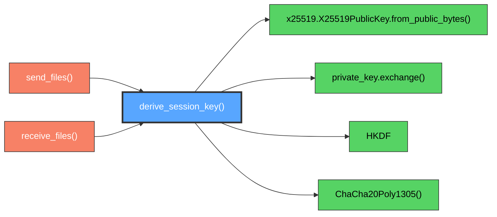

# SecureCrypto.derive_session_key()

ECDH + HKDF key derivation for authenticated session establishment.

## Overview

The core cryptographic method that establishes a secure session key using Elliptic Curve Diffie-Hellman (ECDH) key exchange combined with HKDF key derivation. This method fuses the ephemeral key exchange with a pre-shared authentication token to create a session key that provides both perfect forward secrecy and mutual authentication.

## Call Graph

## Parameters

- **`peer_public_key_bytes`** (bytes): Raw peer's X25519 public key (exactly 32 bytes)
- **`shared_token`** (str): Authentication token in format "word-word" (e.g., "ocean-tiger")

## Return Value

**None** - Method modifies internal state by setting `self.cipher` for subsequent encryption/decryption operations.

## Requirements

derive_session_key() shall compute shared secret using X25519 ECDH when peer public key bytes are provided where the shared secret enables secure communication.

derive_session_key() shall derive session key using HKDF-SHA256 when shared secret is computed where the derivation combines shared secret with authentication token.

derive_session_key() shall initialize ChaCha20Poly1305 cipher when session key is derived where the cipher enables authenticated encryption operations.

derive_session_key() shall use authentication token as HKDF salt when deriving session key where the token provides mutual authentication.

derive_session_key() shall produce 256-bit session key when key derivation completes where the key provides sufficient cryptographic strength.
