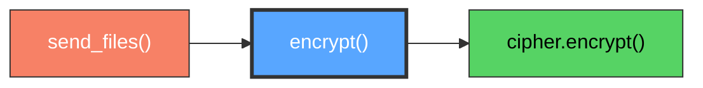

# SecureCrypto.encrypt()

ChaCha20Poly1305 authenticated encryption for secure data transmission.

## Overview

Provides authenticated encryption using the ChaCha20Poly1305 AEAD (Authenticated Encryption with Associated Data) algorithm. This method simultaneously encrypts data for confidentiality and generates an authentication tag to prevent tampering, providing both secrecy and integrity in a single operation.

## Call Graph

## Parameters

- **`data`** (bytes): Plaintext data to encrypt (any length from 0 to ~256 GB)
- **`nonce`** (bytes): 12-byte nonce that must be unique for each encryption with the same key

## Return Value

- **Type**: `bytes`
- **Content**: Encrypted ciphertext with integrated authentication tag
- **Size**: `len(data) + 16` bytes (16-byte authentication tag appended)

## Requirements

encrypt() shall return ciphertext with integrated authentication tag when provided with valid plaintext data and unique nonce where the authentication tag prevents tampering detection.

encrypt() shall use ChaCha20Poly1305 AEAD algorithm when session key has been established via derive_session_key() where the session key provides 256-bit security strength.

encrypt() shall generate unique 12-byte nonce when nonce parameter is not provided where uniqueness prevents cryptographic attacks.

encrypt() shall fail with authentication error when session key is not established where failure prevents insecure transmission.

encrypt() shall produce ciphertext of size len(data) + 16 bytes when encryption succeeds where the additional 16 bytes contain the authentication tag.
