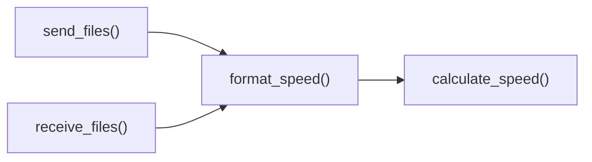

# format_speed()

Human-readable network transfer speed formatting utility.

## Overview

Converts raw bytes-per-second transfer rates into human-readable speed representations with appropriate units (B/s, KB/s, MB/s, GB/s). This utility function provides consistent, user-friendly speed formatting for transfer progress displays and network performance reporting.

## Call Graph

## Parameters

- **`bytes_per_second`** (float): Transfer rate in bytes per second
- **Range**: 0.0 to very large values (theoretically unlimited)
- **Precision**: Supports fractional bytes per second

## Return Value

- **Type**: `str`
- **Format**: `"{value:.1f} {unit}/s"` or `"{value:.0f} {unit}/s"` for large values
- **Units**: B/s, KB/s, MB/s, GB/s, TB/s
- **Examples**: `"1.5 MB/s"`, `"825.3 KB/s"`, `"45 B/s"`

## Requirements

format_speed() shall return human-readable speed string when bytes_per_second parameter is provided where the string includes appropriate units.

format_speed() shall select appropriate unit scale when formatting speed where units progress through B/s, KB/s, MB/s, GB/s based on value magnitude.

format_speed() shall round to one decimal place when speed value is less than 1000 units where rounding improves readability.

format_speed() shall return "0 B/s" when provided speed is zero or negative where this provides consistent output formatting.

format_speed() shall handle very large speeds when high-performance transfers are measured where formatting maintains appropriate precision.
