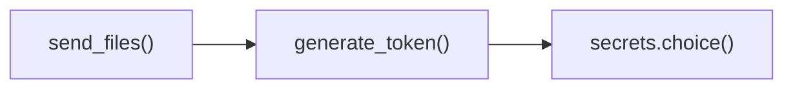

# SecureTokenGenerator.generate_token()

Generate cryptographically secure two-word authentication tokens using enhanced entropy.

## Overview

Generates human-readable two-word authentication tokens using cryptographically secure random number generation enhanced with multiple entropy sources. Combines a curated vocabulary of 200+ memorable words with high-quality randomness to create tokens that are both secure and easy to communicate verbally or visually.

## Call Graph

## Parameters

**None** - Static method that generates tokens independently using internal entropy collection.

## Return Value

- **Type**: `str`
- **Format**: `"word1-word2"` (hyphen-separated)
- **Length**: Variable (typically 10-20 characters)
- **Security**: ~34.6 bits of entropy (2^17.3 possible combinations)
- **Vocabulary**: Curated list of common, memorable English words

## Requirements

generate_token() shall return two-word authentication token when method is invoked where the token format is "word1-word2" with hyphen separator.

generate_token() shall use cryptographically secure random number generation when selecting words where randomness prevents token prediction.

generate_token() shall select words from curated vocabulary when generating tokens where vocabulary contains 200+ memorable English words.

generate_token() shall provide ~34.6 bits of entropy when token is generated where entropy level ensures adequate security for authentication.

generate_token() shall ensure tokens are human-readable when generated where tokens can be easily communicated verbally or visually.
