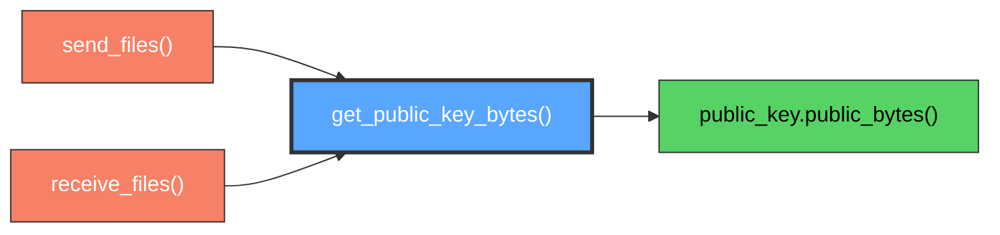

# SecureCrypto.get_public_key_bytes()

Extract X25519 public key for network transmission and key exchange.

## Overview

Extracts the X25519 public key as raw bytes suitable for network transmission during the key exchange phase. This method provides the public component of the ephemeral key pair that enables secure ECDH key agreement without exposing the private key material.

## Call Graph

## Parameters

**None** - Method extracts the public key from the instance's key pair.

## Return Value

- **Type**: `bytes`
- **Size**: Exactly 32 bytes (256 bits)
- **Format**: Raw X25519 public key in standard encoding
- **Usage**: Safe for network transmission and public distribution

## Requirements

get_public_key_bytes() shall return 32-byte public key when method is invoked where the key is in standard X25519 encoding format.

get_public_key_bytes() shall extract public key from established key pair when key pair exists where the key pair was generated during initialization.

get_public_key_bytes() shall provide key suitable for network transmission when extraction completes where the key can be safely shared with peers.

get_public_key_bytes() shall maintain key pair security when public key is extracted where private key remains protected within the instance.

get_public_key_bytes() shall enable key exchange operations when public key is transmitted where the key enables ECDH shared secret computation.
