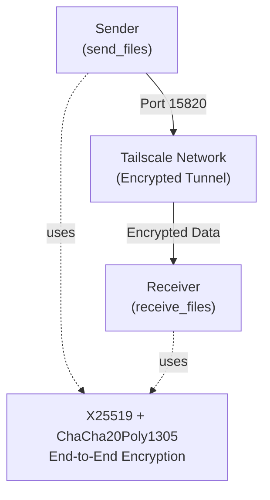
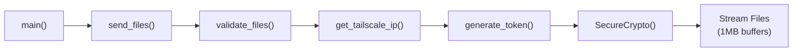
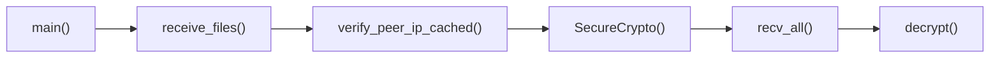
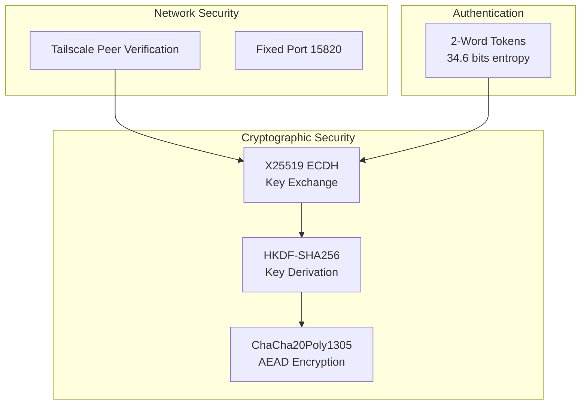

# Transfer Files System Overview

Secure file transfer program over Tailscale networks using end-to-end encryption with automatic key exchange and peer authentication.

## System Architecture

## Transfer Protocol Flow

### Sender Workflow

### Receiver Workflow

## Security Architecture

## Performance Features

- **Optional Blosc+LZ4 Compression**: User-selectable compression for bandwidth reduction (default: No)
- **Unified Streaming Protocol**: Single-pass I/O (read → optionally compress → hash → stream)
- **1MB Buffer Strategy**: Memory-efficient for large files, 3-10x faster for many small files
- **Batch Metadata Transmission**: Reduces network overhead for libraries/venvs
- **Connection Caching**: 30-second TTL for peer verification
- **Perfect Forward Secrecy**: Ephemeral X25519 keys protect past communications

## Key Components

| Component | Purpose | Security Level |
|-----------|---------|----------------|
| **TailscaleDetector** | Network peer validation and IP discovery | Safety-Critical |
| **SecureCrypto** | End-to-end encryption and key management | Safety-Critical |
| **SecureTokenGenerator** | Human-readable authentication tokens | Security-Critical |
| **send_files() / receive_files()** | Main transfer coordination | Security-Critical |
| **Utility Functions** | File validation, speed calculation, etc. | Reliability-Critical |

---

*Use the navigation panel to explore detailed documentation for each component. All documentation includes formal specifications, call graphs, and security analysis.*
