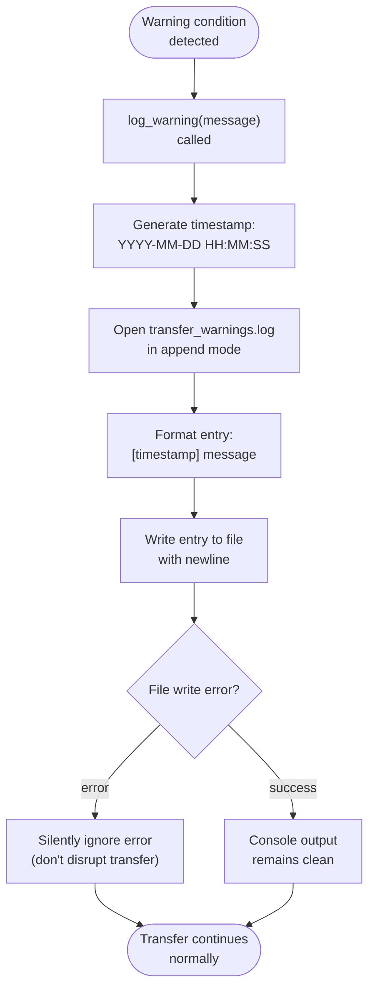

# log_warning() Function

Silent warning logging system that maintains clean console output while capturing detailed warning information.

## Overview

Core logging function that writes warnings to `transfer_warnings.log` file instead of console output. Ensures clean user interface while providing comprehensive warning information for troubleshooting and monitoring.

## Function Signature

```python
def log_warning(message: str):
    """Log warning message to transfer_warnings.log file"""
    try:
        timestamp = datetime.datetime.now().strftime("%Y-%m-%d %H:%M:%S")
        with open("transfer_warnings.log", "a", encoding="utf-8") as f:
            f.write(f"[{timestamp}] {message}\n")
    except Exception:
        # Silently ignore logging failures to avoid disrupting transfer
        pass
```

## Parameters

| Parameter | Type | Description |
|-----------|------|-------------|
| `message` | `str` | Warning message to log to file |

## Return Value

- **Type**: `None`
- **Description**: Function writes to log file or silently ignores failures

## Warning Categories

### **File Access Warnings**
```python
log_warning(f"Permission denied accessing {current_path}")
log_warning(f"Skipping {path} (not a regular file or directory)")
```

### **File Operation Warnings**
```python
log_warning(f"Failed to write to {self.part_file}: {e}")
log_warning(f"Failed to complete file {self.filename}: {e}")
log_warning(f"Could not locate final file for {writer.filename}")
```

### **Resource Monitoring Warnings**
```python
log_warning(f"High FD usage: {current}/{limit} ({percent}%) for {file_count} files")
log_warning(f"Consider transferring fewer files or increasing limits")
```

### **Lock File System Warnings**
```python
log_warning(f"Source file changed: {filename} (will be retransferred)")
log_warning(f"Invalid lock file structure, ignoring: {lock_file_path}")
log_warning(f"Stale lock file found (age: {age}), ignoring")
```

## Log File Format

### **File Location**
- **Filename**: `transfer_warnings.log`
- **Location**: Current working directory
- **Encoding**: UTF-8

### **Entry Format**
```
[YYYY-MM-DD HH:MM:SS] Warning message text
[2024-01-01 12:34:56] Permission denied accessing /protected/file.txt
[2024-01-01 12:35:12] Failed to write to document.pdf.part: No space left on device
[2024-01-01 12:35:45] Source file changed: config.json (will be retransferred)
```

## Warning Logging Workflow



## Design Principles

### **Silent Operation**
- **No Console Output**: Warnings never appear on console
- **Clean Interface**: User sees only essential transfer information
- **Non-Disruptive**: Logging failures don't interrupt transfers

### **Comprehensive Logging**
- **All Warning Types**: File, resource, lock, and operation warnings
- **Detailed Context**: Includes relevant file paths, error details, and system information
- **Timestamp Precision**: Second-level accuracy for debugging

### **Robust Error Handling**
- **Graceful Degradation**: Logging failures are silently ignored
- **Transfer Priority**: Never let logging issues affect file transfer
- **Exception Safety**: Broad exception catching prevents crashes

## Integration Points

### **File Operations**
```python
# Replace console warnings with file logging
# Old: print(f"Warning: Permission denied accessing {path}")
# New: log_warning(f"Permission denied accessing {path}")
```

### **FileWriter Class**
- Write operation failures logged instead of printed
- File completion issues logged for debugging
- Part file management warnings captured

### **TransferLockManager**
- Source file change detection warnings
- Lock file validation issues
- Stale lock cleanup notifications

### **ResourceMonitor**
- File descriptor usage warnings
- System resource limit approaches
- Performance optimization suggestions

## User Experience

### **Console Output Remains Clean**
```bash
# What user sees (clean)
Connecting to sender... Authentication successful
Resuming transfer: 50 completed, 3 partial, 2 fresh files
Receiving 55 file(s) (1234567 bytes total)
Progress: 100.0% (1.5 MB/s)
Transfer complete!

# Warnings are silently logged to file
```

### **Warning Log Available for Troubleshooting**
```bash
# User can check warnings if needed
$ cat transfer_warnings.log
[2024-01-01 12:34:56] Permission denied accessing /protected/config
[2024-01-01 12:35:12] Source file changed: data.json (will be retransferred)
[2024-01-01 12:35:45] High FD usage: 3200/4096 (78%) for 28712 files
```

## Monitoring and Analysis

### **Log Analysis**
- **Pattern Detection**: Identify recurring permission issues
- **Performance Insights**: Track resource usage patterns
- **Transfer Diagnostics**: Debug intermittent transfer issues

### **Operational Benefits**
- **Clean User Experience**: No warning spam on console
- **Complete Audit Trail**: All warnings preserved for analysis
- **System Health Monitoring**: Resource and file system insights

## Error Recovery Guidance

### **Common Warning Patterns**
1. **Permission Issues**: Check file/directory permissions
2. **Disk Space**: Monitor available storage during transfers
3. **Resource Limits**: Adjust system limits for large transfers
4. **File Changes**: Source file modifications during transfer

### **Log File Management**
- **Rotation**: Consider log rotation for long-running systems
- **Cleanup**: Remove old warning logs periodically
- **Monitoring**: Include in system monitoring for operational insights
