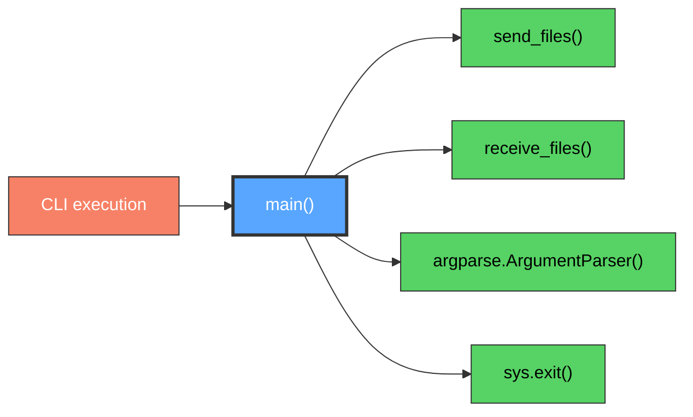

# main() Function

CLI entry point and argument parser.

## Overview

Main entry point that handles command-line argument parsing and dispatches to appropriate send or receive functions. Provides user interface for the Transfer Files system.

## Call Graph

## Parameters

| Parameter | Type | Description |
|-----------|------|-------------|
| `command` | `str` | Either "send" or "receive" |
| `files` | `List[str]` | Files/directories to send (send mode only) |
| `connection` | `str` | Connection string ip:token (receive mode only) |
| `--pod` | `flag` | Bind to/accept connections from localhost (127.0.0.1) for containerized environments |

## Return Value

- **Type**: `None`
- **Description**: Function exits with status code 0 on success or raises SystemExit on failure

## Requirements

main() shall parse command-line arguments when program is executed where arguments determine send or receive operation mode.

main() shall invoke send_files() when command is "send" and file paths are provided where send mode transmits files to receiving peer.

main() shall invoke receive_files() when command is "receive" and connection string is provided where receive mode accepts files from sending peer with automatic resume detection.

main() shall validate command-line argument combinations when parsing completes where validation ensures required arguments are present.

main() shall exit with appropriate status codes when operations complete or fail where status codes indicate success or failure to shell.
