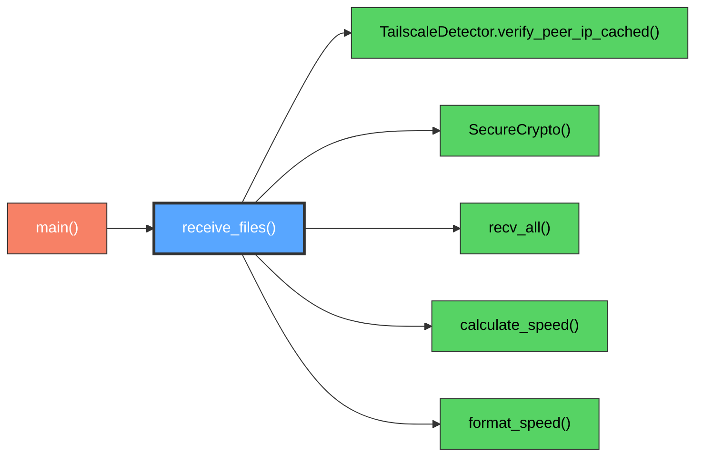
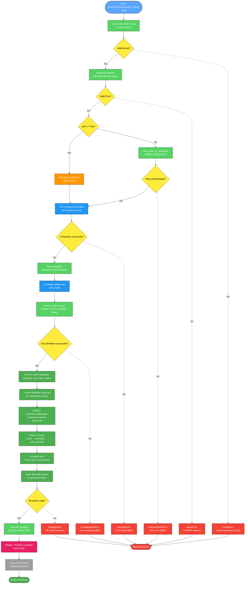
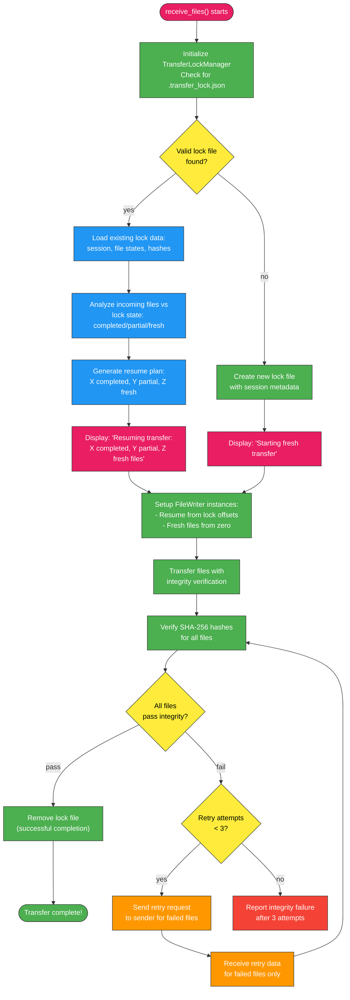

# receive_files() Function

High-performance file reception client with streaming protocol and end-to-end decryption.

## Overview

Main client function that connects to sender, performs key exchange, and securely receives files using the optimized streaming protocol. Handles connection parsing, peer verification, and file reconstruction from streamed data with batch metadata processing.

## Call Graph



## Parameters

| Parameter | Type | Description |
|-----------|------|-------------|
| `connection_string` | `str` | Connection string in format "ip:token" |
| `pod` | `bool` | Accept connections from localhost for containerized environments (default: False) |

## Return Value

- **Type**: `None`
- **Description**: Function completes file reception or raises exception on failure

## Requirements

receive_files() shall parse connection string to extract IP address and authentication token when connection_string parameter is provided where the format is "ip:token".

receive_files() shall establish TCP connection to sender on port 15820 when IP address is parsed where connection timeout is 30 seconds.

receive_files() shall verify sender IP using Tailscale peer verification when pod parameter is False where verification ensures sender is authenticated peer.

receive_files() shall perform key exchange with sender when TCP connection is established where the exchange uses X25519 ECDH with shared authentication token.

receive_files() shall decrypt all received data using ChaCha20Poly1305 when session key is derived where decryption ensures data confidentiality and integrity.

receive_files() shall automatically detect compression from metadata when batch metadata is received where decompression is applied only if sender enabled compression.

receive_files() shall receive files using streaming protocol with incremental saving when encrypted data is received where FileWriter instances handle direct stream-to-disk writing without memory accumulation.

receive_files() shall accept connections from localhost when pod parameter is True where localhost acceptance enables containerized deployment.

receive_files() shall automatically detect and resume from existing lock files and .part files where TransferLockManager instances verify existing data integrity before continuing transfers.

## Algorithm Flow



## Automatic Resume Workflow

The receiver implements intelligent automatic resume detection without requiring manual flags or user intervention.



### **Lock File State Management**

The automatic resume system uses `.transfer_lock.json` files to track transfer state:

```json
{
  "version": "1.0",
  "session_id": "uuid-12345",
  "timestamp": "2024-01-01T12:00:00Z",
  "sender_ip": "100.101.29.44",
  "total_files": 1000,
  "total_size": 1048576000,
  "files": {
    "document.pdf": {
      "status": "completed",
      "size": 524288,
      "transferred_bytes": 524288,
      "original_hash": "sha256-hash",
      "partial_hash": "sha256-hash"
    },
    "archive.zip": {
      "status": "in_progress",
      "size": 1048576,
      "transferred_bytes": 262144,
      "partial_hash": "sha256-partial"
    }
  }
}
```

### **File Integrity Retry System**

When integrity check failures occur, the receiver automatically retries up to 3 times:

1. **Detection**: SHA-256 hash mismatch detected for received files
2. **Request**: Send retry request to sender with failed file list
3. **Resend**: Sender locates and resends only failed files
4. **Verification**: Re-verify integrity of retried files
5. **Loop**: Repeat up to 3 total attempts
6. **Completion**: Success after retry or final error report

### **Resume Decision Logic**

```python
def get_resume_plan(incoming_files):
    completed_files = []    # Skip entirely
    resume_files = []       # Resume from partial offset
    fresh_files = []        # Transfer from beginning

    for file in incoming_files:
        lock_status = lock_data.files[file.name].status
        if lock_status == "completed":
            completed_files.append(file.name)
        elif lock_status == "in_progress":
            resume_files.append((file.name, transferred_bytes))
        else:
            fresh_files.append(file)
```

## Security Considerations

### **Connection Security**
- **Connection String Validation**: Strict parsing of "ip:token" format prevents injection attacks
- **IP Address Validation**: IPv4 format validation prevents malformed address exploitation
- **Connection Timeout**: 30-second timeout prevents hanging connections and resource exhaustion

### **Peer Authentication**
- **Tailscale Peer Verification**: Uses `verify_peer_ip_cached()` to ensure sender is authenticated Tailscale peer
- **Cached Verification**: 30-second cache prevents repeated CLI calls while maintaining security
- **Pod Mode Override**: Localhost-only mode for containerized deployments bypasses peer verification

### **Cryptographic Security**
- **Perfect Forward Secrecy**: Ephemeral X25519 keys generated per session protect past communications
- **Mutual Authentication**: ECDH key exchange with shared token prevents man-in-the-middle attacks
- **Session Key Derivation**: HKDF-SHA256 with token salt ensures both parties know the shared secret

### **File Reception Security**
- **Directory Traversal Prevention**: File paths validated before FileWriter creation to prevent escape attacks
- **Incremental File Writing**: FileWriter class manages .part files with atomic completion operations
- **Lock File Validation**: TransferLockManager verifies existing transfer state and file integrity before resuming
- **Integrity Verification**: SHA-256 hash verification ensures files haven't been tampered with
- **Atomic File Operations**: Files written to .part locations then atomically renamed on completion

### **Data Protection**
- **Authenticated Decryption**: ChaCha20Poly1305 AEAD prevents accepting tampered data
- **Streaming Decryption**: Data decrypted in chunks and written directly to disk without memory accumulation
- **Memory Efficiency**: FileWriter approach eliminates large memory buffers, reducing attack surface
- **Secure Cleanup**: Connection resources and .part files properly cleaned up on failure

### **Error Handling Security**
- **Fail-Safe Design**: Any error condition results in complete operation failure
- **Information Disclosure Prevention**: Error messages don't reveal sensitive network or cryptographic details
- **Resource Cleanup**: Ensures connections and partial files cleaned up on failure

### **Network Security**
- **Port Consistency**: Fixed port 15820 provides predictable endpoint for firewall configuration
- **Connection Limits**: Single connection per session prevents resource exhaustion
- **Timeout Protection**: Network timeouts prevent indefinite blocking

### **FileWriter Security**
- **Incremental Hash Verification**: Continuous SHA-256 hashing during writing ensures data integrity
- **Resume Integrity**: Existing .part files re-hashed completely before resuming to detect tampering
- **Atomic Completion**: Files moved from .part to final names only after complete verification
- **Partial File Isolation**: Incomplete transfers isolated with .part extension to prevent confusion
- **Memory Attack Prevention**: Direct stream-to-disk writing eliminates large memory allocations

### **Attack Mitigation**
- **Replay Protection**: Ephemeral keys and session binding prevent replay attacks
- **DoS Protection**: Connection timeouts and resource limits prevent denial of service
- **Data Validation**: All received data validated before processing or storage
- **Resume Attack Prevention**: .part files validated with hash verification before continuation
- **Side-Channel Resistance**: Cryptographic operations designed to resist timing attacks
