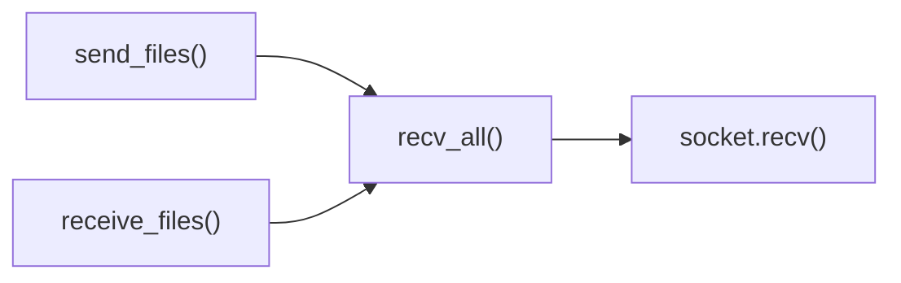

# recv_all() Function

Reliable socket data reception with guaranteed completeness.

## Overview

Utility function that ensures complete reception of a specified amount of data from a socket connection. Handles partial receives and network interruptions to guarantee data integrity.

## Call Graph

## Parameters

| Parameter | Type | Description |
|-----------|------|-------------|
| `sock` | `socket.socket` | TCP socket connection to read from |
| `size` | `int` | Exact number of bytes to receive |

## Return Value

- **Type**: `bytes`
- **Description**: Exactly `size` bytes of data from the socket

## Requirements

recv_all() shall receive exactly the requested number of bytes when size parameter is provided where the function handles partial receives.

recv_all() shall loop until all bytes are received when socket provides partial data where looping ensures complete data reception.

recv_all() shall handle connection interruptions when network issues occur where the function attempts to continue receiving.

recv_all() shall raise exception when connection is closed prematurely where closure prevents complete data reception.

recv_all() shall return bytes object of exact size when all data is received where the size matches the requested size parameter.

## Security Considerations

### **Network Security**
- **Connection Validation**: Verifies socket is properly connected before attempting data reception
- **Timeout Protection**: Relies on socket timeout settings to prevent indefinite blocking
- **Resource Management**: Limits individual recv() calls to prevent memory exhaustion
- **Connection State Monitoring**: Detects connection closure to fail fast on network issues

### **Data Integrity**
- **Complete Reception Guarantee**: Ensures exactly the requested number of bytes are received
- **Partial Receive Handling**: Properly handles TCP's stream nature where data may arrive in chunks
- **Size Validation**: Validates received data matches expected size before returning
- **Buffer Management**: Safely accumulates received data without corruption

### **DoS Attack Mitigation**
- **Memory Limits**: Chunks reception into reasonable sizes (64KB) to prevent memory exhaustion
- **Progress Tracking**: Enables monitoring of reception progress for detecting stalls
- **Fail-Fast Design**: Immediately fails on connection errors rather than hanging indefinitely
- **Resource Bounds**: Natural bounds on memory usage based on expected data size

### **Error Handling Security**
- **Connection Failure Detection**: Properly detects when peer closes connection unexpectedly
- **Exception Safety**: Ensures no partial data returned on errors
- **Information Leakage Prevention**: Error messages don't reveal sensitive network details
- **Graceful Degradation**: Fails cleanly without corrupting application state

### **Socket Security**
- **Socket State Validation**: Verifies socket is in proper state for receiving data
- **Error Propagation**: Properly propagates socket errors without masking security issues
- **Resource Cleanup**: Doesn't manage socket lifecycle, leaves that to caller
- **Protocol Compliance**: Works within TCP/IP protocol constraints

### **Attack Surface Minimization**
- **Simple Operation**: Performs only data reception, no protocol interpretation
- **No Network Logic**: Doesn't make networking decisions, just receives requested data
- **Caller Responsibility**: Pushes security decisions to calling functions
- **Minimal Dependencies**: Uses only standard socket operations
