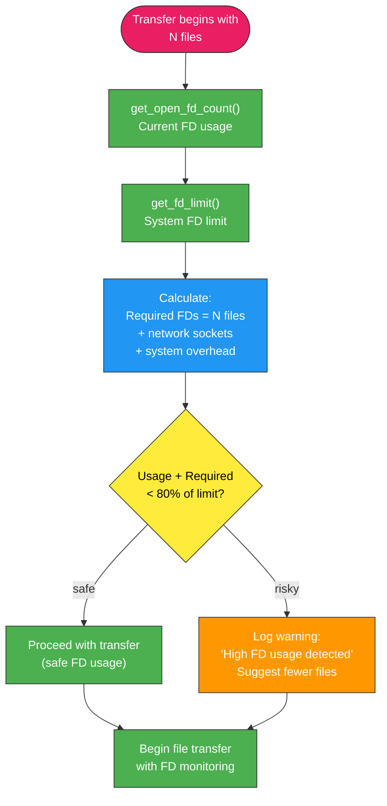

# ResourceMonitor Class

System resource monitoring to prevent file descriptor exhaustion during large transfers.

## Overview

Static utility class that monitors system resource usage to prevent "Too many open files" errors when transferring large numbers of files. Provides cross-platform file descriptor monitoring and proactive warnings for resource-intensive transfers.

## Class Definition

```python
class ResourceMonitor:
    """Monitor system resource usage to prevent file descriptor exhaustion"""

    @staticmethod
    def get_open_fd_count() -> Optional[int]:
        """Get the current number of open file descriptors for this process"""

    @staticmethod
    def get_fd_limit() -> Optional[int]:
        """Get the soft limit for file descriptors"""

    @staticmethod
    def check_fd_usage(file_count: int) -> bool:
        """Check if transfer would exceed safe FD limits"""
```

## Method Details

### get_open_fd_count()
Returns current number of open file descriptors for the process.

**Returns:** `Optional[int]` - Current FD count, or None if unavailable

**Implementation Strategy:**
1. **Linux**: Counts entries in `/proc/self/fd/`
2. **Other Unix**: Uses resource module with conservative estimate
3. **Fallback**: Returns None for unsupported platforms

### get_fd_limit()
Returns the soft limit for file descriptors from system resource limits.

**Returns:** `Optional[int]` - Soft FD limit, or None if unavailable

**Uses:** `resource.getrlimit(resource.RLIMIT_NOFILE)` on Unix systems

### check_fd_usage()
Analyzes whether a transfer with given file count would risk FD exhaustion.

**Parameters:**
- `file_count` (int): Number of files in planned transfer

**Returns:** `bool` - True if transfer appears safe, False if risky

**Algorithm:**
1. Gets current FD usage and system limits
2. Estimates additional FDs needed for transfer
3. Calculates safety margin (typically 10-20% of limit)
4. Issues warnings if approaching limits

## Resource Monitoring Workflow



## Platform Support

### **Linux Systems**
- **Primary Method**: `/proc/self/fd/` directory enumeration
- **Accuracy**: Exact current FD count
- **Performance**: Fast directory listing operation

### **macOS/Unix Systems**
- **Method**: `resource.getrlimit()` with estimation
- **Accuracy**: Conservative estimates to prevent issues
- **Fallback**: Uses known system defaults when unavailable

### **Containerized Environments**
- **Detection**: Works within container FD limits
- **Docker Support**: Respects container resource constraints
- **Kubernetes**: Compatible with pod resource limits

## Error Prevention

### **File Descriptor Exhaustion**
```
Error: Too many open files - system file descriptor limit exceeded
This typically happens when reading very large numbers of files.
Try transferring fewer files at once or increase system limits.
```

**Prevention Strategy:**
- Proactive monitoring before transfer begins
- Early warning when approaching limits
- Suggested remediation (batch transfers, limit increases)

### **Resource Optimization**
- **Lazy File Opening**: FileWriter opens files only when needed
- **Immediate Closure**: Files closed immediately after operations
- **Minimal FD Usage**: Network sockets reused efficiently

## Integration with Transfer System

### **Receiver Integration**
```python
# Check for potential resource issues
ResourceMonitor.check_fd_usage(file_count)
```

Called during transfer initialization to prevent resource exhaustion before it occurs.

### **Warning System Integration**
- Resource warnings logged to `transfer_warnings.log`
- Console remains clean with suggested actions only
- Provides specific guidance for resolution

### **Error Recovery**
- Graceful handling when limits are exceeded
- Clear error messages with recovery suggestions
- Maintains partial files for potential resume

## Configuration Recommendations

### **System Tuning**
```bash
# Increase FD limits (temporary)
ulimit -n 4096

# Permanent limits (/etc/security/limits.conf)
* soft nofile 4096
* hard nofile 8192
```

### **Large Transfer Guidelines**
- **< 1,000 files**: Usually safe on default systems
- **1,000-10,000 files**: Monitor FD usage, consider batching
- **> 10,000 files**: Increase system limits or use batched transfers

## Monitoring and Alerting

### **Warning Thresholds**
- **70% FD usage**: Information logged
- **80% FD usage**: Warning issued with suggestions
- **90% FD usage**: Strong warning with batch transfer recommendation

### **Logged Information**
```
[2024-01-01 12:00:00] High FD usage: 3200/4096 (78%) for 28712 files
[2024-01-01 12:00:00] Consider transferring fewer files or increasing limits
```
