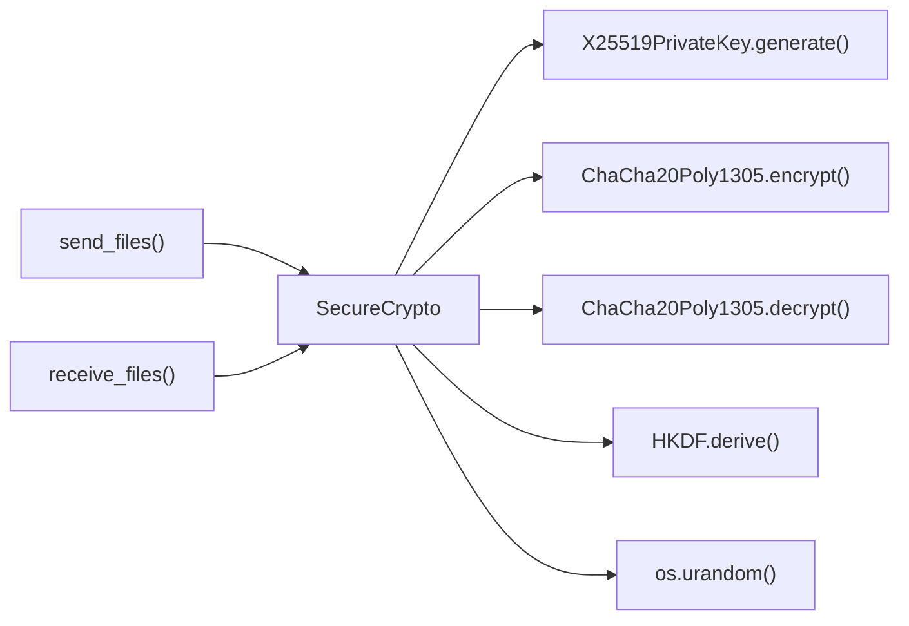

# SecureCrypto Class

End-to-end encryption using modern cryptography.

## Overview

Implements file transfer encryption using X25519 elliptic curve Diffie-Hellman key exchange and ChaCha20Poly1305 authenticated encryption. Provides comprehensive cryptographic protection for file transfers.

## Call Graph

## Parameters

| Method | Description |
|--------|-------------|
| `__init__()` | Initialize cryptographic key pair for session |
| `derive_session_key(peer_public_key_bytes, shared_secret)` | Derive session key using ECDH + HKDF |
| `encrypt(data, nonce)` | Encrypt data with ChaCha20Poly1305 |
| `decrypt(encrypted_data, nonce)` | Decrypt and authenticate ciphertext |
| `get_public_key_bytes()` | Get public key bytes for key exchange |

## Return Value

- **Type**: `SecureCrypto` instance
- **Description**: Initialized cryptographic context with ephemeral X25519 key pair

## Requirements

SecureCrypto class shall provide end-to-end encryption using X25519 key exchange when cryptographic operations are needed where the key exchange enables secure communication.

SecureCrypto class shall implement ChaCha20Poly1305 authenticated encryption when session keys are established where encryption provides confidentiality and integrity.

SecureCrypto class shall derive session keys using HKDF-SHA256 when shared secrets are computed where key derivation combines ECDH output with authentication tokens.

SecureCrypto class shall generate ephemeral key pairs when instances are created where ephemeral keys provide perfect forward secrecy.

SecureCrypto class shall maintain separate methods for encryption and decryption when cryptographic operations are performed where separation provides clear functional interfaces.
