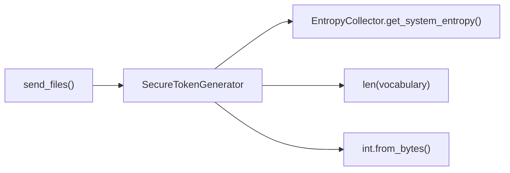

# SecureTokenGenerator Class

Generate secure two-word authentication tokens.

## Overview

Generates human-readable authentication tokens using a 200+ word vocabulary. Provides cryptographically secure token generation for transfer authentication while maintaining usability through memorable word pairs.

## Call Graph

## Parameters

| Method | Description |
|--------|-------------|
| `generate_token()` | Generate secure two-word authentication token (static method) |

## Return Value

- **Type**: `SecureTokenGenerator` instance
- **Description**: Token generator with cryptographically secure random generation

## Requirements

SecureTokenGenerator class shall generate cryptographically secure authentication tokens when token generation is requested where tokens use two-word format.

SecureTokenGenerator class shall select words from curated vocabulary when generating tokens where vocabulary contains 200+ memorable English words.

SecureTokenGenerator class shall provide ~34.6 bits of entropy when tokens are generated where entropy level ensures adequate security for authentication.

SecureTokenGenerator class shall format tokens with hyphen separator when word selection completes where format is "word1-word2".

SecureTokenGenerator class shall ensure tokens are human-communicable when generated where tokens can be easily spoken or typed.
