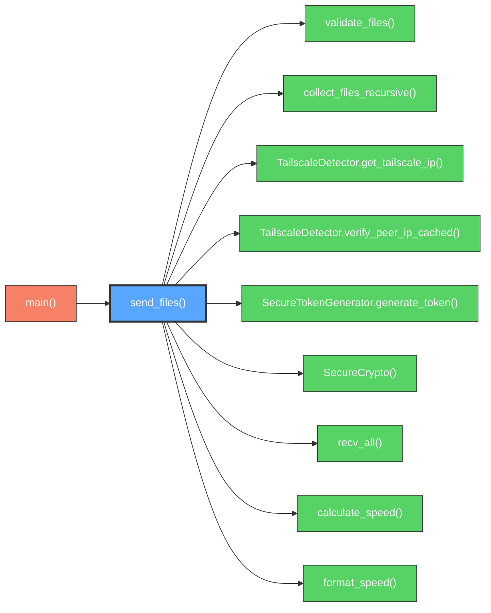
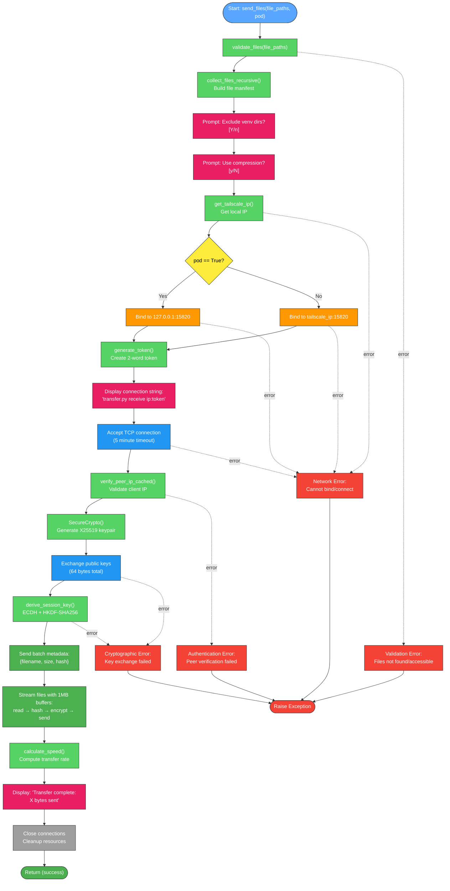

# send_files() Function

High-performance file transmission server with streaming protocol and end-to-end encryption.

## Overview

Main server function that handles file transmission using optimized streaming buffers. Sets up TCP server, performs key exchange, and securely transmits files using a unified streaming protocol optimized for maximum throughput, especially for many small files.

## Call Graph

## Parameters

| Parameter | Type | Description |
|-----------|------|-------------|
| `file_paths` | `List[str]` | List of file/directory paths to send |
| `pod` | `bool` | Bind to localhost for containerized environments (default: False) |

## Return Value

- **Type**: `None`
- **Description**: Function completes file transmission or raises exception on failure

## Requirements

send_files() shall establish TCP server on port 15820 when function is invoked with valid file paths where the server accepts connections from authenticated Tailscale peers.

send_files() shall validate all file paths before transmission when file_paths parameter is provided where validation ensures files exist and are accessible.

send_files() shall perform key exchange with connecting client when client connection is established where the exchange uses X25519 ECDH with shared authentication token.

send_files() shall encrypt all transmitted data using ChaCha20Poly1305 when session key is derived where encryption provides confidentiality and integrity.

send_files() shall prompt user to exclude virtual environment directories when venv patterns are detected where exclusion improves transfer efficiency by skipping cache directories.

send_files() shall prompt user to enable compression when preparing to transfer files where compression defaults to No and uses Blosc+LZ4 when enabled.

send_files() shall stream files using 1MB buffers when transmitting data where streaming optimizes performance for large files and many small files.

send_files() shall bind to localhost when pod parameter is True where localhost binding enables containerized deployment.

send_files() shall verify connecting peer IP using Tailscale peer verification when pod parameter is False where verification prevents unauthorized access.

## Algorithm Flow

## Security Considerations

### **Network Security**
- **Peer Verification**: Uses `verify_peer_ip_cached()` to ensure only authenticated Tailscale peers can connect
- **Port Binding**: Fixed port 15820 provides consistent endpoint, pod mode allows containerized deployment
- **Connection Timeout**: 5-minute timeout prevents resource exhaustion from stalled connections

### **Cryptographic Security**
- **Perfect Forward Secrecy**: Ephemeral X25519 keys generated per session protect past communications if keys compromised
- **Authenticated Encryption**: ChaCha20Poly1305 AEAD prevents tampering and provides confidentiality
- **Key Exchange Security**: ECDH + HKDF-SHA256 with shared token ensures mutual authentication

### **Authentication Security**
- **Two-Word Tokens**: 34.6 bits entropy (~200² combinations) provides adequate security for short-lived sessions
- **Token Integration**: Shared token mixed into HKDF salt prevents man-in-the-middle attacks
- **Visual Verification**: Human-readable tokens enable out-of-band verification

### **File System Security**
- **Path Validation**: `validate_files()` prevents path traversal attacks and validates file accessibility
- **Integrity Protection**: SHA-256 hashing during streaming enables end-to-end integrity verification
- **Access Control**: File permissions checked before transmission

### **Performance Security**
- **Memory Management**: 1MB streaming buffers prevent excessive memory usage with large files
- **Resource Limits**: Connection timeouts and buffer limits prevent DoS attacks
- **Streaming Protocol**: Single-pass I/O minimizes data exposure time in memory

### **Attack Mitigation**
- **Replay Protection**: Ephemeral keys and nonces prevent replay attacks
- **Timing Attack Resistance**: ChaCha20Poly1305 provides constant-time operations
- **Side-Channel Protection**: Secure key generation and handling procedures
