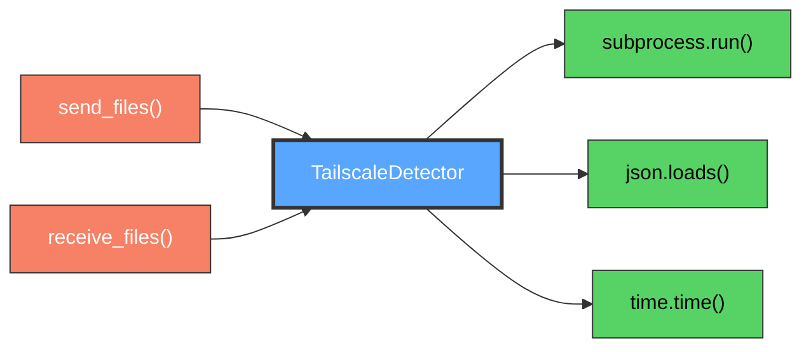

# TailscaleDetector Class

Network peer validation and Tailscale integration.

## Overview

Handles Tailscale network detection, IP address resolution, and peer verification. Provides caching mechanisms for performance optimization and security validation of network participants.

## Call Graph

## Parameters

| Method | Description |
|--------|-------------|
| `get_tailscale_ip()` | Get local Tailscale IP address |
| `verify_peer_ip_cached(ip)` | Cached peer validation with time-based cache |
| `verify_peer_ip(ip)` | Direct real-time peer validation |
| `get_tailscale_peers()` | Enumerate network peers |
| `is_tailscale_ip(ip)` | Validate IP is in Tailscale range |

## Return Value

- **Type**: `TailscaleDetector` instance
- **Description**: Network detector with peer validation capabilities

## Requirements

TailscaleDetector class shall provide network peer validation when peer verification is needed where validation ensures only authenticated peers can connect.

TailscaleDetector class shall cache peer information when validation is performed where caching improves performance by avoiding repeated CLI calls.

TailscaleDetector class shall detect local Tailscale IP address when network discovery is needed where detection enables connection endpoint determination.

TailscaleDetector class shall parse Tailscale CLI output when peer information is retrieved where parsing extracts IP addresses and hostnames.

TailscaleDetector class shall maintain cache freshness when peer data ages where freshness ensures accurate peer status information.
