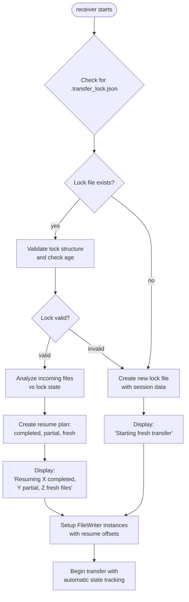

# TransferLockManager Class

Manages transfer state and automatic resume functionality through lock file system.

## Overview

Core class that handles automatic resume detection, transfer state management, and file change verification. Creates and manages `.transfer_lock.json` files containing session information, file status, and integrity hashes for seamless transfer resumption without manual flags.

## Class Definition

```python
class TransferLockManager:
    """Manages transfer state and automatic resume functionality"""

    LOCK_FILE_NAME = ".transfer_lock.json"
    LOCK_VERSION = "1.0"

    def __init__(self, working_dir: str = "."):
        self.working_dir = Path(working_dir)
        self.lock_file_path = self.working_dir / self.LOCK_FILE_NAME
        self.lock_data = None
```

## Key Methods

### create_lock_file()
Creates new transfer lock file with session metadata and file listings.

**Parameters:**
- `sender_ip` (str): IP address of sending peer
- `file_list` (List[Dict]): List of files being transferred
- `total_size` (int): Total transfer size in bytes

**Returns:** Session UUID string

### load_existing_lock()
Loads and validates existing lock file if present.

**Returns:** `bool` - True if valid lock file was loaded

**Features:**
- Validates lock file structure and version
- Checks for stale locks (older than 24 hours)
- Handles corrupted or invalid lock files gracefully

### get_resume_plan()
Analyzes what needs to be transferred based on existing lock state.

**Parameters:**
- `incoming_files` (List[Dict]): Files being transferred

**Returns:** Dict with keys:
- `action`: "resume" or "fresh_transfer"
- `completed_files`: List of already completed files
- `resume_files`: List of (filename, bytes) tuples for partial files
- `fresh_files`: List of files to transfer fresh

### update_file_status()
Updates status of specific file in lock.

**Parameters:**
- `filename` (str): File being updated
- `status` (str): One of "pending", "in_progress", "completed", "failed"
- `transferred_bytes` (int): Bytes written so far
- `partial_hash` (str, optional): SHA-256 hash of partial data

### verify_source_files_unchanged()
Verifies source files haven't changed since lock creation.

**Parameters:**
- `source_file_paths` (Dict[str, str]): Mapping of filename to file path

**Returns:** List[str] of changed file names

**Features:**
- SHA-256 hash comparison for change detection
- Automatic marking of changed files for retransfer
- Warning logging for changed files

### cleanup_on_completion()
Removes lock file after successful transfer completion.

## Lock File Format

```json
{
  "version": "1.0",
  "session_id": "uuid-string",
  "timestamp": "2024-01-01T12:00:00Z",
  "sender_ip": "100.101.29.44",
  "total_files": 1234,
  "total_size": 567890123,
  "files": {
    "path/to/file1.txt": {
      "status": "completed|in_progress|pending|failed",
      "size": 12345,
      "original_hash": "sha256-hash-of-source-file",
      "transferred_bytes": 12345,
      "partial_hash": "sha256-hash-of-partial-data",
      "last_modified": "2024-01-01T11:59:00Z"
    }
  }
}
```

## Automatic Resume Workflow



## Security Features

### **State Validation**
- **Lock File Integrity**: JSON structure validation prevents corrupted state
- **Session Verification**: UUID-based session tracking prevents cross-session confusion
- **Age Verification**: Automatic cleanup of stale locks (24+ hours old)

### **File Change Detection**
- **Hash Verification**: SHA-256 comparison detects source file modifications
- **Automatic Retransfer**: Changed files automatically marked for fresh transfer
- **Integrity Assurance**: Partial file hash verification ensures resume safety

### **Atomic Operations**
- **Atomic Writes**: Lock file updates use temp-file-and-rename for atomicity
- **Graceful Failure**: Corrupted locks ignored with fallback to fresh transfer
- **Resource Cleanup**: Automatic cleanup prevents accumulation of stale state

## Error Handling

- **Corrupted Lock Files**: Graceful fallback to fresh transfer
- **Missing Source Files**: Handles files that no longer exist
- **Permission Errors**: Silent fallback with warning logging
- **Disk Space Issues**: Robust error handling during lock file operations

## Integration Points

### **FileWriter Integration**
- FileWriter instances receive TransferLockManager reference
- Automatic progress updates to lock file during writing
- Status tracking through file completion lifecycle

### **Receiver Integration**
- Automatic lock detection on receiver startup
- Resume plan generation drives FileWriter initialization
- Completion cleanup removes lock file

### **Warning System Integration**
- File change warnings logged to transfer_warnings.log
- Lock file errors logged for debugging
- Stale lock cleanup logged for monitoring
