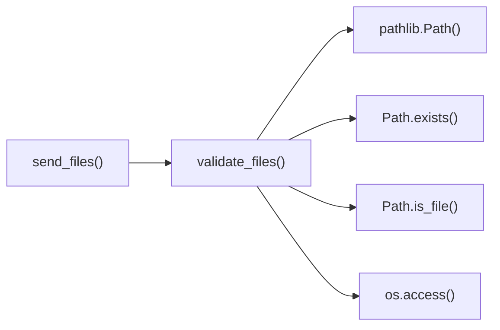

# validate_files() Function

File existence and accessibility validation.

## Overview

Validates that all specified file paths exist and are accessible for reading. Converts string paths to Path objects and performs comprehensive file system checks before transfer operations.

## Call Graph

## Parameters

| Parameter | Type | Description |
|-----------|------|-------------|
| `file_paths` | `List[str]` | List of file/directory path strings to validate |

## Return Value

- **Type**: `List[Path]`
- **Description**: List of validated Path objects ready for transfer

## Requirements

validate_files() shall convert string paths to Path objects when file_paths parameter is provided where Path objects enable modern path operations.

validate_files() shall verify each path exists on filesystem when Path objects are created where verification prevents transmission of non-existent files.

validate_files() shall check read permissions for each path when existence is confirmed where permission checking ensures files are accessible.

validate_files() shall return list of validated Path objects when all validations pass where the list contains only accessible files and directories.

validate_files() shall raise exception when any path validation fails where failure prevents transmission of inaccessible content.

## Security Considerations

### **Path Traversal Protection**
- **Absolute Path Resolution**: Converts all paths to absolute paths to prevent relative path confusion
- **Directory Traversal Prevention**: Validates paths don't contain "../" sequences that could escape intended directories
- **Symbolic Link Handling**: Resolves symbolic links to prevent link-based directory traversal attacks
- **Path Canonicalization**: Uses path.resolve() to normalize paths and eliminate ambiguous representations

### **File System Security**
- **Existence Verification**: Ensures files actually exist before attempting operations to prevent time-of-check-time-of-use races
- **Permission Validation**: Checks both OS-level permissions and actual file access to ensure readability
- **File Type Validation**: Verifies paths point to regular files or directories, rejecting special files like devices
- **Access Control**: Respects file system permissions to prevent unauthorized file access

### **Input Validation Security**
- **Path String Validation**: Validates input paths are well-formed strings before Path conversion
- **Empty Input Rejection**: Rejects empty or None path lists to prevent undefined behavior
- **Path Length Limits**: Implicitly limited by file system maximum path length restrictions
- **Character Encoding**: Handles various path encoding schemes safely through Path object abstraction

### **Race Condition Prevention**
- **Atomic Validation**: Performs existence and permission checks in close succession to minimize race windows
- **Access Testing**: Performs actual file access test beyond permission checks to verify current accessibility
- **Consistent State**: Ensures file state doesn't change between validation and subsequent operations
- **Error Handling**: Gracefully handles files that disappear or become inaccessible between checks

### **Error Information Security**
- **Fail-Fast Design**: Immediately fails on first invalid path rather than processing remaining paths
- **Limited Error Details**: Error messages provide necessary information without revealing sensitive file system details
- **No Information Leakage**: Doesn't expose directory structure or file system organization in error messages
- **Consistent Error Handling**: All validation failures result in appropriate exception types

### **Resource Security**
- **Limited File System Access**: Only accesses files specified in input, doesn't enumerate directories
- **Memory Efficiency**: Uses Path objects which are lightweight representations of file system paths
- **Handle Management**: Properly closes file handles opened during access testing
- **No Persistent Resources**: Doesn't maintain open file handles or locks after validation

### **Attack Surface Minimization**
- **Read-Only Operations**: Only performs read-based checks, never modifies file system state
- **Limited Scope**: Validates only specified paths, doesn't perform broader file system operations
- **No Network Operations**: Purely local file system validation with no network dependencies
- **Minimal Dependencies**: Uses standard library components with well-established security properties

### **File System Attack Mitigation**
- **Symlink Attack Prevention**: Resolves symbolic links to detect attempts to access unauthorized locations
- **TOCTOU Attack Resistance**: Minimizes time between validation and use through immediate processing
- **Directory Traversal Resistance**: Multiple layers of path validation prevent escape attacks
- **Permission Bypass Prevention**: Actual access testing prevents reliance on potentially stale permission data
