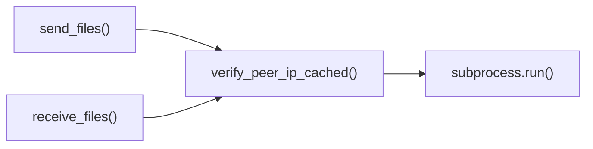

# TailscaleDetector.verify_peer_ip_cached()

Primary security validation for peer connections using cached data.

## Overview

The primary security validation method for incoming file transfer connections. This method verifies that an IP address belongs to an active Tailscale peer using cached peer information to minimize performance overhead. It serves as the first line of defense against unauthorized connections.

## Call Graph

## Parameters

- **`ip`** (str): IP address to validate in dotted decimal notation (e.g., `"100.101.29.44"`)

## Return Value

- **Type**: `Tuple[bool, str]`
- **Success**: `(True, peer_hostname)` - IP is authenticated Tailscale peer with hostname
- **Failure**: `(False, "unknown_tailscale_peer")` - IP validation failed or peer not found

## Requirements

verify_peer_ip_cached() shall return (True, peer_hostname) when the provided IP address matches an active Tailscale peer in the cached status output where the peer has valid authentication credentials.

verify_peer_ip_cached() shall return (False, "unknown_tailscale_peer") when the provided IP address is not found in Tailscale peer list or when Tailscale CLI execution fails.

verify_peer_ip_cached() shall refresh peer cache when cache age exceeds 30 seconds where cache age is measured from last successful status retrieval.

verify_peer_ip_cached() shall execute "tailscale status --json" command when cache refresh is required where the command provides current peer information.

verify_peer_ip_cached() shall parse JSON output to extract peer IP addresses and hostnames when Tailscale command succeeds where parsing creates IP-to-hostname mapping.
